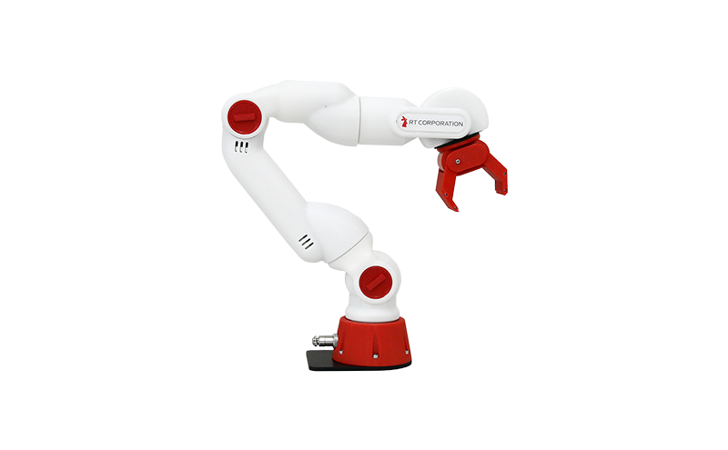

# CRANE-X7 実機で動力学が学べるアームロボット

## CRANE-X7とは

CRANE-X7（クラインエックスセブン）はCRANE+V2の上位機種であり、ROSに標準対応した研究・開発用ロボットです。

| 項目 | 仕様 |
| ---- | ----------- |
| 型番 | RT-CRANE-X7 |
| 作業有効範囲 | 500mm |
| 動作速度 | 内蔵モータの仕様を参照 |
| 可搬重量 | 約0.5kg |
| 自由度 | 7 |
| エンドエフェクタ | 両開きハンド１ |
| サイズ | 130×100×708(mm)　(設置用固定金属5mm含む) |
| 重量 | 約1.8kg(設置用固定金属含む) |
| 通信 | 内部はRS485通信 |
| 内蔵モータ | ROBOTIS製XM540-W270-R,XM430-W350-R 搭載 |
| 電源 | 12V10A 120W給電 |

## 製品ページ

[製品ページはこちら](https://rt-net.jp/products/crane-x7/)

## ショップページ

[ショップページはこちら](https://www.rt-shop.jp/index.php?main_page=product_info&cPath=1348_1&products_id=3660)
