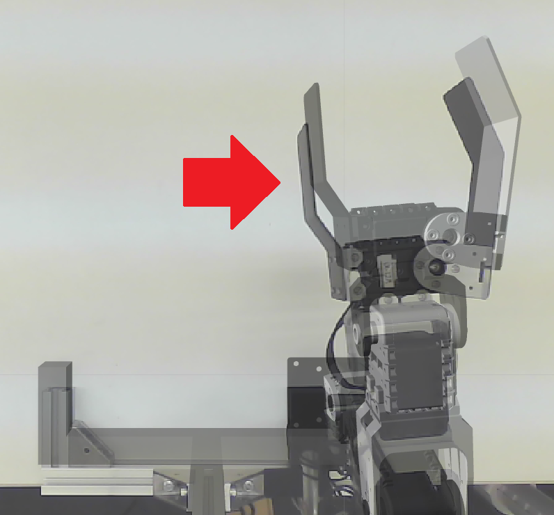
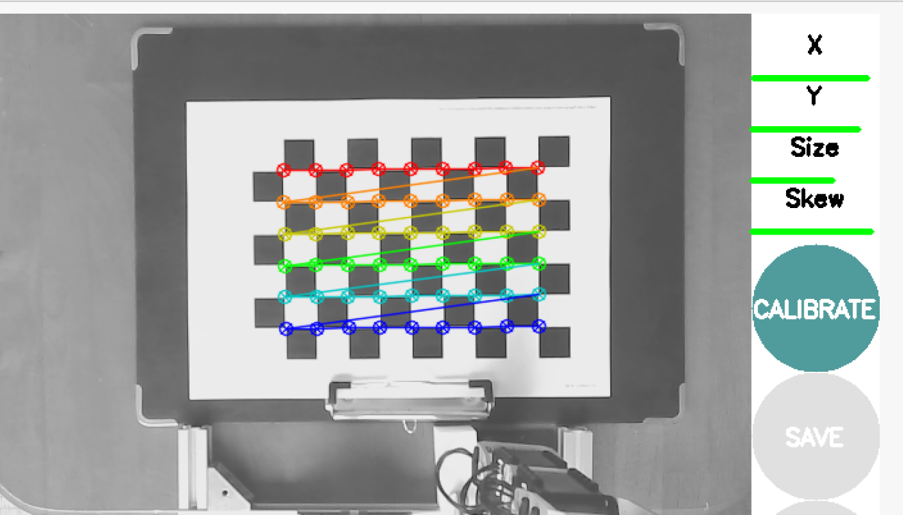
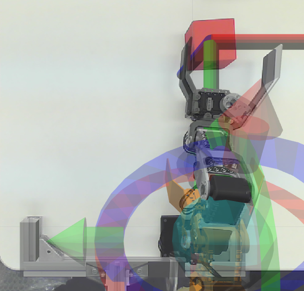

# カメラのキャリブレーション
このページではCRANE+ V2のカメラのキャリブレーション方法について説明します。

カメラのキャリブレーションを行うと、カメラ画像の歪みやズレを補正することができます。

キャリブレーションが必要な例として、下図のようにカメラ画像とCRANE+ V2のモデルにズレが発生している場合などがあります。



このズレが大きい場合、対象物を正確に検出できず、ピックアンドプレースが失敗する可能性があります。
キャリブレーションはこのようなカメラ画像のズレを小さくすることができます。

## 使用機材 {: #requirements}

* 設置済みCRANE+ V2本体（Webカメラ搭載モデル）
    * [製品マニュアル](https://rt-net.jp/products/cranev2/)を読んで設置済みの状態を前提としています
* ノートパソコン等のPC
    * OS（**Ubuntu Desktop 22.04**）がインストール済みであることを前提としています
    * ROS 2がインストール済みであることを前提としています
        * [ROS 2のインストール手順](./install.md)を参照してください
    * ROS 2用のパッケージがインストール済みであることを前提としています
        * [ROS 2パッケージのインストール手順](./package-install.md)を参照してください
* キャリブレーション用のチェスボード
    * [OpenCVのサンプル](https://github.com/opencv/opencv/blob/master/samples/data/chessboard.png)をA4サイズで印刷してください

## キャリブレーション用パッケージのインストール {: #install}
ノートパソコン等のPCに、キャリブレーションを行うためのROS 2パッケージをインストールします。

```bash
sudo apt install ros-humble-camera-calibration-parsers
sudo apt install ros-humble-camera-info-manager
sudo apt install ros-humble-launch-testing-ament-cmake
sudo apt install ros-humble-image-pipeline
```

## CRANE+ V2のカメラを起動 {: #launch-camera}
CRANE+ V2のカメラを起動します。
`port_name`はCRANE+ V2との通信に使用しているUSB通信ポート、`video_device`は使用するカメラのデバイス名を指定してください。
```bash
ros2 launch crane_plus_examples demo.launch.py port_name:=/dev/ttyUSB0 use_camera:=true video_device:=/dev/video0
```

## キャリブレーションの実行 {: #launch-calibration}
カメラのキャリブレーションを実行します。
`size`はチェスボードの交点の数を指定し、`square`はチェスボードの1マスの大きさ（単位はメートル）を指定してください。
```bash
ros2 run camera_calibration cameracalibrator --size 6x9 --square 0.022 --ros-args -r image:=/image_raw
```



カメラ映像が表示されたら、カメラの画角内でチェスボードを遠ざけたり、近づけたり、傾けたり、回転させたりなど動かします。

CALIBRATEボタンが緑色になったら押してしばらく待ちます。

その後、SAVEボタンを押すと、`/tmp`ディレクトリに`calibrationdata.tar.gz`ファイルができます。

## パラメータファイルの配置 {: #replace-file}
パラメータファイル`ost.yaml`を`crane_plus/crane_plus_examples/config/camera_info.yaml`に配置します。
```bash
cd /tmp
tar -xvf calibrationdata.tar.gz
cp ost.yaml ~/ros2_ws/src/crane_plus/crane_plus_examples/config/camera_info.yaml
```

以上でCRANE+ V2のカメラのキャリブレーションは完了です。

パラメータファイルを配置した後に再びカメラを起動すると、カメラ画像とCRANE+ V2のモデルのズレが小さくなっていることが確認できます。




## 参考
- [Camera Calibration — Navigation 2 1.0.0 documentation](https://navigation.ros.org/tutorials/docs/camera_calibration.html)
