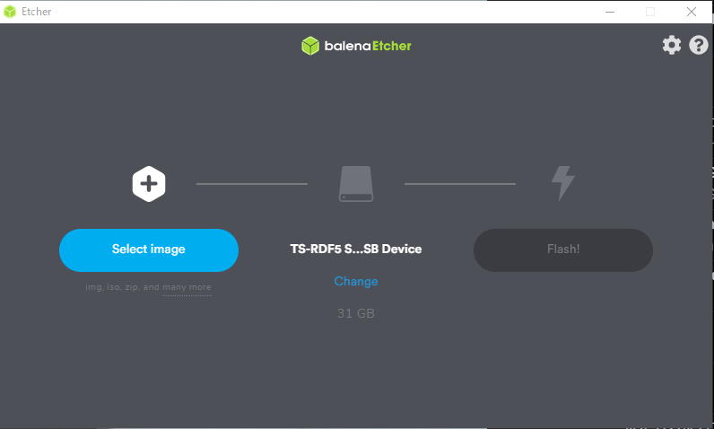

# イメージファイルの書き込みと初期設定

このページでは、Jetson Nano Mouse用のイメージファイル
の書き込み方法と初期設定について説明します。

このイメージファイルはカスタム版[JetPack](https://developer.nvidia.com/embedded/jetpack)です。  
JetPackはJetson Nano用のLinuxである[L4T](https://developer.nvidia.com/embedded/linux-tegra)をベースとしてCUDAドライバなどのソフトウェアをまとめたものです。
カスタム版JetPackは公式のJetPackのイメージファイルをベースとしてJetson Nano Mouse向けに機械学習ライブラリの[PyTorch](https://pytorch.org/)や[Tensorflow](https://www.tensorflow.org/?hl=ja)、
プログラム実行環境である[JupyterLab](https://jupyter.org/)等があらかじめインストールされています。
その他、Jetson Nano MouseのLEDやモータを駆動するために必要な
[デバイスドライバ](https://github.com/rt-net/JetsonNanoMouse)
があらかじめインストールされています。
## 使用機材 {: #requirements}


* Jetson Nano Mouse本体
* Jetson Nano Mouse用電源（バッテリでも電源変換ケーブルつきACアダプタでも可）
* NVIDIA Jetson Nano 開発者キット B01 ※1
* microSDカード ※2
* HDMI入力付きのモニタ
* USBキーボードとマウス
* USB接続の無線LANアダプタ（オプション） ※3
* 操作用ノートパソコン


### ※1 Jetson Nanoについて {: #requirements-jetson-nano}

Jetson Nano開発者キットには以下の2種類が存在します。

* 現行モデルのCSIカメラを2つ搭載できる「NVIDIA Jetson Nano 開発者キット B01」
* 旧モデルでCSIカメラを1台のみ搭載できる「NVIDIA Jetson Nano 開発者キット A01」

2021年11月現在、新品で販売されているJetson Nanoの大半はCSIカメラを2つ搭載できる「NVIDIA Jetson Nano 開発者キット B01」ですが、予め確認した上でのご購入をおすすめします。

!!! info
    以前発売されていたモデルの「NVIDIA Jetson Nano 開発者キット A01」および現行モデルのメモリ2GBのJetson Nano 開発者キットでもJetson Nano Mouse自体は制御可能です。  
    ただし、Jetson Nano Mouseについている2台のカメラのうちの1台のみの接続となります。  
    カメラが1台のみの接続の場合およびメモリが少ないJetson Nanoの場合は一部のコンテンツを利用できません。

### ※2 microSDカードについて {: #requirements-microsd}

- **microSDカードの容量は64GB以上を推奨します**
- **microSDカードの転送速度は[UHS-1以上が推奨されています](https://forums.developer.nvidia.com/t/what-size-in-gb-of-sd-card-is-recommended/72161)**
    - SDカードのスピードクラスについては[SD Association](https://www.sdcard.org/ja/developers-2/sd-standard-overview/speed-class/)の解説を参照してください
    - 十分な速度が出ないmicroSDカードを使うと正常にOSが起動しない場合があるようです

### ※3 無線LANアダプタについて {: #requirements-wifi}

無線LANアダプタはTP-Link社の<a href="https://www.tp-link.com/jp/home-networking/adapter/tl-wn725n/" rel="noopener" target="_blank">TL-WN725N</a>で動作確認をしています。

## イメージファイルのダウンロードと書き込み {: #preparation}

イメージファイルをダウンロードし、microSDカードに書き込みます。

!!! warning
    microSDカードの取り付けやJetson Nanoの電源操作時に、
    Jetson NanoやJetson Nano Mouse本体を**故障させないように**注意してください。
    詳細はJetson Nano Mouseの**[製品マニュアル](https://rt-net.jp/products/jetson-nano-mouse/#downloads)を参照してください**。

1. microSDカードにイメージファイルを書き込むためのアプリケーションを用意します。
ここでは[balenaEtcher](https://www.balena.io/etcher/)を使用します。
1. 下記のリンクをクリックして、イメージファイル(`jnmouse_jp451_v3.zip`)をダウンロードします
    - [https://drive.google.com/open?id=1-eIXdtrHD8VY3M7C0sCRKE9LNfNPd97h](https://drive.google.com/open?id=1-eIXdtrHD8VY3M7C0sCRKE9LNfNPd97h)
    - zipファイルのサイズは約9GBですが、展開後は約30GBに増えます。
    - イメージファイルの詳細は[「イメージファイルについて」](#about-image-file)を参照してください
2. microSDカードをPCに接続します
3. Etcherを起動し、イメージファイルをmicroSDカードに書き込みます
    - 

## 起動 {: #boot}

Jetson Nano Mouseの電源投入までの手順を説明します。より詳しい手順については[取扱説明書](https://rt-net.jp/products/jetson-nano-mouse/#downloads){target=_blank rel=noopener}を参照してください。

1. 電源がOFFになっていることを確認し、microSDカードをJetson Nanoに取り付けます。
2. コネクタ基板の向きを確認します。
    * {: style="width:400px"}
3. Jetson Nano Mouseの電源を入れます。Motor SWをOFFにし、Main SWをONにします。
    * {: style="width:400px"}


## 初期設定 {: #initialization}

Jetson Nano Mouseの電源投入後の初期設定について説明します。

ここからはJetson Nano Mouseに搭載されたJetson Nanoで操作します。
SSHやVNCでログインしたり、HDMI接続ができるモニタとキーボードを繋ぐ方法とありますが、今回はモニタとキーボードを繋いで初期設定まで行います。

HDMI接続ができるモニタとUSBキーボード、マウスを接続します。今回は無線でインターネット接続したいのでさらに無線LANアダプタを接続します。


### ログインユーザ名とパスワード {: #login}

ログインユーザ名とパスワードはどちらも`jetson`です。

### ネットワーク設定 {: #network-configuration}

無線LANを使用する場合は、画面上のメニューから接続先を設定します。


ネットワーク接続が完了すると、`Connection Information`からIPアドレスを確認できます。


### Jetson Nanoのパフォーマンス設定とブートローダ更新 {: #update-bootloader}

1. ++ctrl+alt+t++を入力してターミナルを起動します
1. 次のコマンドを実行し、Jetsonのパフォーマンス設定を行います
```sh
$ cd ~/jnmouse_utils/scripts
$ ./configure-jetson.sh
```
1. 次のコマンドを実行し、ブートローダを更新します
```sh
$ cd ~/jnmouse_utils/scripts
$ ./update-qspi.sh
```
    - [「ブートローダについて」](#about-bootloader)に書かれている注意事項も確認してください

### SPI通信の有効化 {: #enable-spi}

Jetson NanoのGPIOを設定するためのツールである`Jetson-IO`を使って、`SPI1`を有効にし、
Jetson NanoとJetson Nano Mouseの基板が通信できるようにします。
これによりJetson Nano Mouse前方の距離センサが使えるようになります。

1. 次のコマンドを実行し、Jetson-IOを起動します
```sh
$ sudo /opt/nvidia/jetson-io/jetson-io.py
```
1. `Configure 40-pin expansion header`を選択し、

spi1を有効にするfunctionとして選択します。

function選択後は<code>Back</code>を選び、メニューに戻ります。
<code>Select one of the following options:</code>と言われるので、<code>Save and reboot to reconfigure pins</code>を選択して再起動します。


## デバイスドライバの更新 {: #update-driver}

[Jetson Nano Mouseのデバイスドライバ](https://github.com/rt-net/JetsonNanoMouse){target=_blank rel=noopener}を更新する場合は次のコマンドを実行します

```sh
$ cd ~/JetsonNanoMouse
$ git pull origin master
# デバイスドライバのアンインストール
$ sudo make uninstall
# デバイスドライバのビルド
$ make build
# デバイスドライバのインストール
$ sudo make install
```

## その他 {: #others}

### イメージファイルについて {: #about-image-file}

Jetson Nano Mouseのイメージファイルは、
Jetson Nano用のOSである[JetPack](https://developer.nvidia.com/embedded/jetpack)をベースに作成しています。
このイメージファイルには、
[Jetson Nano Mouseのデバイスドライバ](https://github.com/rt-net/JetsonNanoMouse)や
機械学習ライブラリの[PyTorch](https://pytorch.org/)と
[Tensorflow](https://www.tensorflow.org/?hl=ja)、
プログラム実行環境である[JupyterLab](https://jupyter.org/)等が
あらかじめインストールされています。

イメージファイルの詳細や最新の情報について知りたい場合はGitHubリポジトリを参照してください。

- セットアップ方法：[https://github.com/rt-net/jnmouse_utils/tree/master/setup-scripts](https://github.com/rt-net/jnmouse_utils/tree/master/setup-scripts)
- イメージファイル作成用スクリプト：[jnmouse-setup-jetpack-4-5-1.sh](https://github.com/rt-net/jnmouse_utils/blob/master/setup-scripts/jnmouse-setup-jetpack-4-5-1.sh)

### ブートローダについて {: #about-bootloader}

Jetson NanoにはSDカードとは別にブートローダが書き込まれたQSPI-NOR Flashメモリが存在します [^1] [^2]。

ブートローダを更新すると、JetPack 4.5から導入されたMaxSPIと呼ばれる新しいバージョンのものに置き換わります [^3]。

ブートローダを更新すると以下の2つの影響があります。

1. 対象のSDカードのイメージは、JetPack 4.4以前の旧ブートローダを搭載したJetson
Nano開発キットでは動作しなくなります
1. 対象のJetson Nano開発キットは、以前のブートローダを使用したイメージでは動作しなくなります

なお、SDK Managerを使ってJetPack 4.4以前のバージョンを書き込むことでブートローダは元に戻せます。
更新しないで古いバージョンのブートローダを使用することもできますが、その場合は**SPI通信機能が使用できません**。

ブートローダの詳細はNVIDIA社の公開する情報
（[https://developer.nvidia.com/embedded/linux-tegra-r325](https://developer.nvidia.com/embedded/linux-tegra-r325)）
をご確認ください。

[^1]: What is QSPI-NOR - Jetson & Embedded Systems / Jetson Nano - NVIDIA Developer Forums  
[https://forums.developer.nvidia.com/t/what-is-qspi-nor/145758](https://forums.developer.nvidia.com/t/what-is-qspi-nor/145758)

[^2]: QSPI-NOR BOM addition for Jeton Nano developer kit modules - Jetson & Embedded Systems / Jetson Nano - NVIDIA Developer Forums  
[https://forums.developer.nvidia.com/t/qspi-nor-bom-addition-for-jeton-nano-developer-kit-modules/173477](https://forums.developer.nvidia.com/t/qspi-nor-bom-addition-for-jeton-nano-developer-kit-modules/173477)

[^3]: JetPackインストール中に表示されるメッセージから名称を確認できます。  
  
さらに[https://developer.nvidia.com/embedded/linux-tegra-r3251](https://developer.nvidia.com/embedded/linux-tegra-r3251)より"L4T Driver Package (BSP)"をダウンロードすると詳細を確認できます。