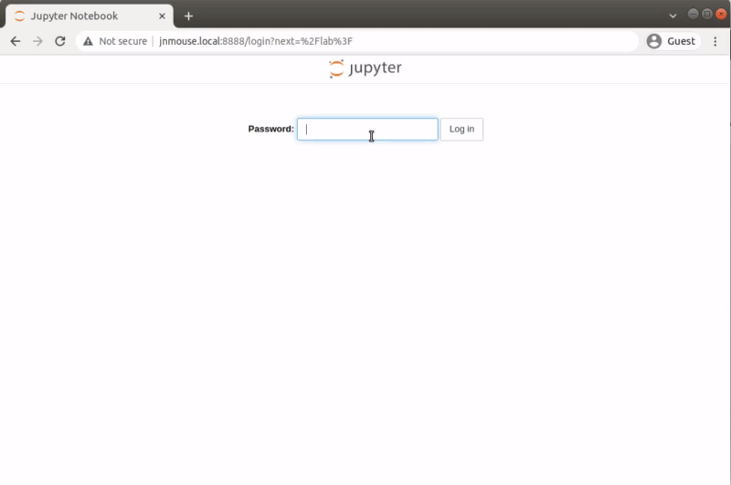
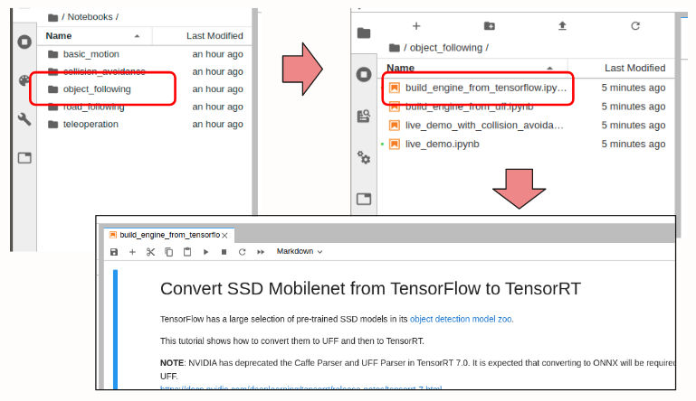
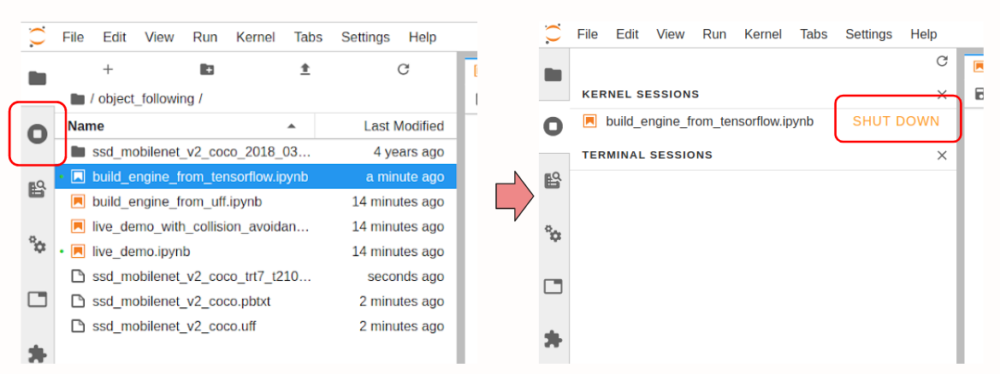

このページではobject_followingのサンプルを実行する方法を紹介します。
[Jetson Nano Mouse用Jupyter Notebookの準備](./install.md)の続きです。
## Jupyter Notebookの起動

ノートパソコン等操作用PCのWebブラウザから操作します。

<code>http://jnmouse.local:8888</code>にアクセスします。ログイン画面ではパスワードに"jetson"を入力します。

## object_followingサンプル実行の準備 {: #preparation}

物体検出のための学習済みのモデルを準備します。`object_following/build_engine_from_tensowflow.py`を開きます。

実行ボタンを押してセルを1つずつ実行していきます。

最後まで進めていくと`Finished converting... successfully`と表示され、
`ssd_mobilenet_v2_coco_trt7_t210.engine`という名前のファイルが新しく作成されていることを確認できます。

以上でobject_followingのJupyter Notebookが実行できるようになりました。

セッションをシャットダウンしてメモリを確保しておきます。

## object_followingサンプルの実行 {: #execution}

<code>Notebooks/object_following/live_demo.ipynb</code>を開き、セルを1つずつ実行していきます。

実行例の動画です。学習済みモデルの読み込みには少し時間がかかる場合があります。

<iframe width="560" height="315" src="https://www.youtube.com/embed/7h1j4Cx99is" title="YouTube video player" frameborder="0" allow="accelerometer; autoplay; clipboard-write; encrypted-media; gyroscope; picture-in-picture" allowfullscreen></iframe>

うまく実行できない場合はカーネルをリスタートするとよいかもしれません。

その他のサンプルについては以下のJetBot公式のページに詳しく説明されていますのでこちらをご覧ください。

* [https://jetbot.org/master/examples/basic_motion.html](https://jetbot.org/master/examples/basic_motion.html){target=_blank rel=noopener}
* [https://jetbot.org/master/examples/teleoperation.html](https://jetbot.org/master/examples/teleoperation.html){target=_blank rel=noopener}
* [https://jetbot.org/master/examples/collision_avoidance.html](https://jetbot.org/master/examples/collision_avoidance.html){target=_blank rel=noopener}
* [https://jetbot.org/master/examples/road_following.html](https://jetbot.org/master/examples/road_following.html){target=_blank rel=noopener}

## どうしてもうまくいかないとき

よく起きるトラブル（開発中に頻繁に遭遇したトラブル）についてGitHub上でまとめています。

[https://github.com/rt-net/jnmouse_utils/blob/master/docs/TroubleShooting.md](https://github.com/rt-net/jnmouse_utils/blob/master/docs/TroubleShooting.md){target=_blank rel=noopener}

カメラの映像が映らいないなどJupyter Notebookが思ったように動かない場合、よくある問題であればJupyter Notebookの該当セルのドキュメントまたは上記ページが参考になるかもしれません。

※__Jetson Nano Mouseのソフトウェアは基本的にオープンソースソフトウェアとして「AS IS」（現状有姿のまま）で提供しています。本ソフトウェアに関する無償サポートはありません。__
バグの修正や誤字脱字の修正に関するリクエストは常に受け付けていますが、それ以外の機能追加等のリクエストについては社内のガイドラインを優先します。
