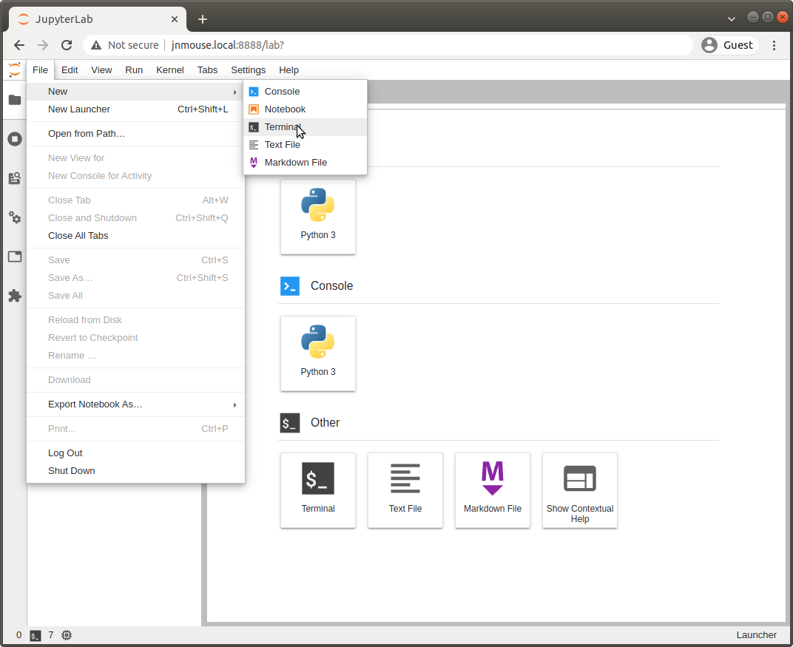

このページではJetson Nano Mouse用AI教材である[rt-net/jnm_jupyternotebook](https://github.com/rt-net/jnm_jupyternotebook)の紹介をします。
またインストール方法を紹介します。

## サンプルの概要 {: #about-this-sample}

機械学習を利用したプログラムでロボットを動かす<b><a href="https://jupyter.org/" target="_blank" rel="noopener">Jupyter Notebook</a></b>のサンプルです。
NVIDIA社が公開しているAIロボットキットである<a href="https://www.nvidia.com/ja-jp/autonomous-machines/embedded-systems/jetbot-ai-robot-kit/" target="_blank" rel="noopener">JetBot</a>のプロジェクトをベースにしています。
そのため、JetBotの解説を読みながら理解をすすめることもできます。

プロモーション動画の1:03以降で紹介しています。

<iframe width="560" height="315" src="https://www.youtube.com/embed/KIklhoDDCD0?start=63" title="YouTube video player" frameborder="0" allow="accelerometer; autoplay; clipboard-write; encrypted-media; gyroscope; picture-in-picture" allowfullscreen></iframe>


## このサンプルの実行に必要なもの {: #requirements}

* Jetson Nano
    * OS（**JetPack 4.5.1**）がインストール済みであること
        * インストール方法については[イメージファイルの書き込み](../driver/install.md)を参照してください
    * 「[サンプルを動かす](../driver/samples.md)」での動作確認が済んでいること
* ノートパソコン等操作用PC
    * Google Chromeが起動すること
        * その他のブラウザでは正常に動作しない場合があります
    * Jetson Nanoと同じネットワークに接続されていること

## Jupyter Notebookについて {: #about-jupyter-notebook}

Jupyter Notebookを使うと<b>コードとドキュメントが一体化</b>した「ノートブック形式」でコードとドキュメントを保存できます。


コードはテキストエディタやIDEで書いて、ドキュメントは別で用意することは一般的でしたが、Jupyter Notebookが使える場合にはコードを対話的に実行して動作確認し、<b>ドキュメントを一緒につけて保存</b>することができます。
Jupyter Notebookを活用した教材もあり、たとえば、千葉工業大学の上田隆一先生の「<a href="https://www.kspub.co.jp/book/detail/5170069.html" target="_blank" rel="noopener">詳解　確率ロボティクス</a>」ではJupyter Notebookでロボットのシミュレーションとアルゴリズムの解説をしています。

## Jetson Nano Mouseの起動 {: #power-on}

コネクタ基板の向きを確認します。Motor SWをOFFにし、Main SWをONにしておきます。

{: style="width:400px"}

{: style="width:400px"}

## JupyterLabへのログイン {: #jupyterlab-login}

Webブラウザで`http://jnmouse.local:8888`を開き、パスワード"jnmouse"を入力してログインします。


FileメニューからTerminalを起動します。



以後、このページ内のコマンドは以下の画像のようにこのTerminalに入力していきます。


## Jetson Nano Mouse用のJupyter Notebookの更新 {: #update}

`git`コマンドで<a href="https://github.com/rt-net/jnm_jupyternotebook" rel="noopener" target="_blank">rt-net/jnm_jupyternotebook</a>を更新します。

<!-- <style type="text/css">
.highlight code::before {
  content: "$ ";
}
.highlight code span::before {
  content: "$ ";
  color: var(--md-code-fg-color);
}
</style> -->

```bash
$ cd $HOME/jnm_jupyternotebook
$ git pull
```

つぎにJetson Nano Mouse制御用のPythonパッケージ、「jnmouse」の最新版をインストールします。  

```bash
$ sudo python3 setup.py install
```

次にダウンロードしてきた最新版のJupyter Notebookを<code>~/Notebooks</code>ディレクトリにコピーします。
本チュートリアルで紹介しているイメージでは起動時に<code>~/Notebooks</code>ディレクトリでJupyter Lab（Jupyter Notebookを拡張したもの）のサーバが8888番ポートで立ち上がるようになっています。

```bash
$ ./scripts/copy_notebook.sh
```

以上でJupyter Notebook実行のための準備は完了です。  
最新のJupyter Notebookを読み込むため、ブラウザのタブを閉じておきます。  
（ページのリロードでも問題ありません。）
