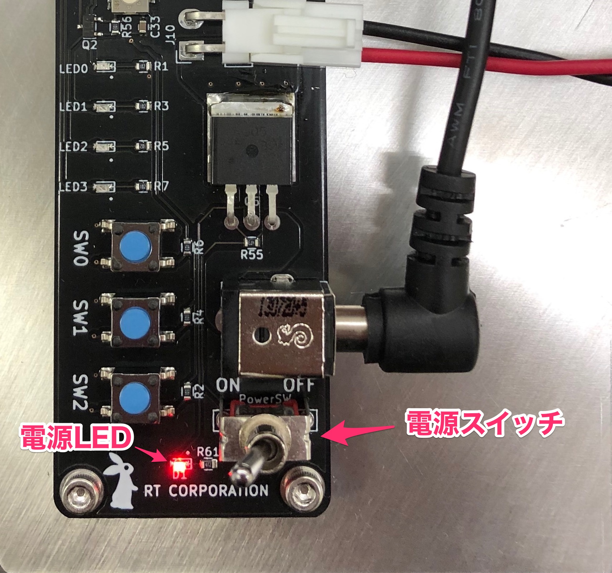
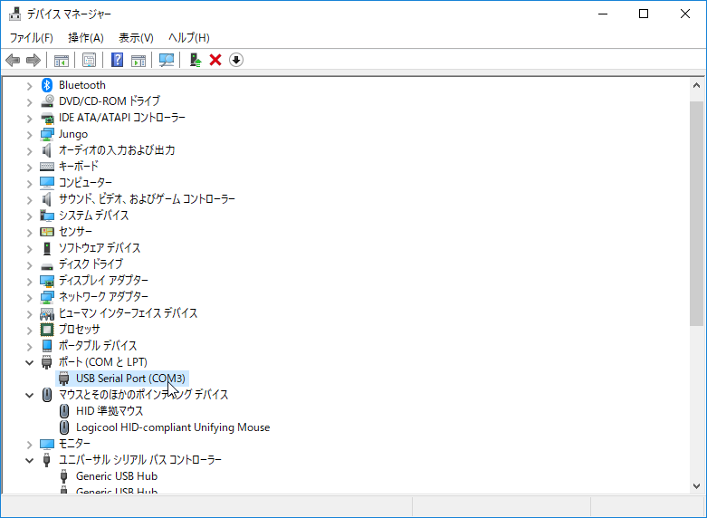
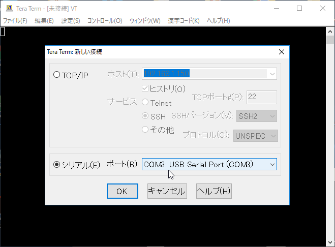
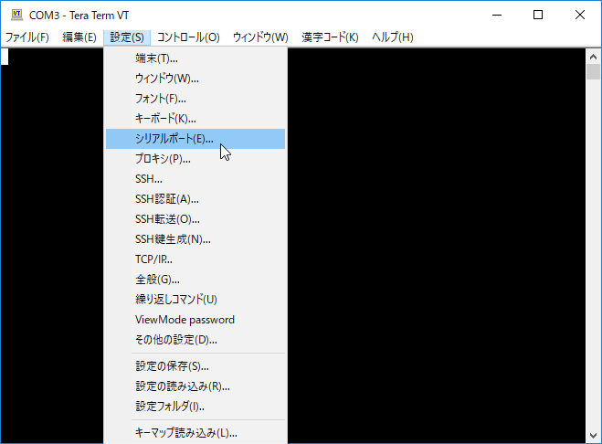
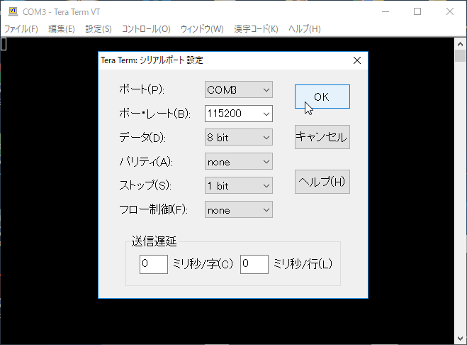
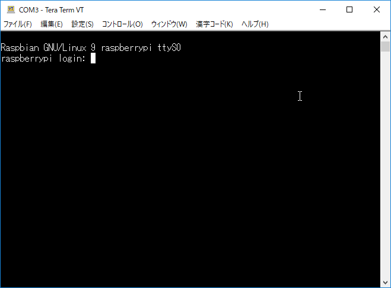
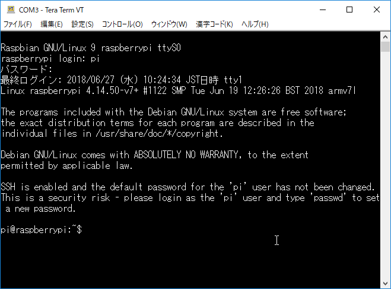

# デバイスドライバのインストール

このページでは
[Raspberry Pi Catのデバイスドライバ](https://github.com/rt-net/RaspberryPiMouse)
のインストール方法を説明します。

Raspberry Pi CatのLEDやモータを駆動するためには、
デバイスドライバが必要です。

!!! info
    出荷時に付属しているRaspberry Pi OSインストール済みのmicroSDカードを利用する場合は、本ページのインストール手順を飛ばしてそのまま[サンプルプログラムの実行](./samples.md)に進むことができます。

## 使用機材 {: #requirements}

* 組み立て済みRaspberry Pi Cat本体
    * [製品マニュアル](https://rt-net.jp/products/raspberry-pi-cat/#downloads)を読んで組み立て済みの状態を前提としています
    * OSの再インストールを行う場合はRaspberry PiからmicroSDカードを取り外す必要があります
* USB Type-Bケーブル（Raspberry Pi Catに同梱されています）
* ノートパソコン等のPC

## OSのインストール {: #os-installation}

Raspberry Pi Catのデバイスドライバは**Ubuntu**と**Raspberry Pi OS (旧称Raspbian)**に対応しています。

後ほどRaspberry Pi Catで**ROS / ROS 2を扱う場合はUbuntu Serverのインストールを推奨します**。

=== "Ubuntu Server 18.04"
    [Ubuntu 18.04 LTSのリリースページ](http://cdimage.ubuntu.com/ubuntu/releases/18.04/release/)から**Ubuntu 18.04 server**のイメージファイル（`ubuntu-18.04.5-preinstalled-server-arm64+raspi4.img.xz`）をダウンロードします。

    ダウンロードしたイメージは[rpi-imager](https://www.raspberrypi.com/software/)等でSDカードに書き込みます。

=== "Ubuntu Server 22.04"
    [Ubuntu 22.04 LTSのリリースページ](http://cdimage.ubuntu.com/ubuntu/releases/22.04/release/)から**Ubuntu 22.04 server**のイメージファイル（`ubuntu-22.04.1-preinstalled-server-arm64+raspi.img.xz`）をダウンロードします。

    ダウンロードしたイメージは[rpi-imager](https://www.raspberrypi.com/software/)等でSDカードに書き込みます。

=== "Raspberry Pi OS"
    Raspberry Pi OSの場合は、サイトからイメージをダウンロードせずに[rpi-imager](https://www.raspberrypi.com/software/)を使用することで、イメージを書き込むことができます。

## Raspberry Piへのログイン {: #raspberry-pi-login}

Raspberry Pi Cat制御基板にはUSBシリアル変換機能が搭載されており、USB Type-BケーブルでPCと接続すると、PCにはVCP（Virtual Com Port）デバイスとして認識されます。

必要に応じてPC用のドライバを[FTDI社のサイト](https://ftdichip.com/drivers/vcp-drivers/)より入手し、インストールしてください。

Windowsでは[Tera Term](https://ja.osdn.net/projects/ttssh2/)、Linuxでは[screen](https://wiki.archlinux.jp/index.php/GNU_Screen)などのソフトウェアを使うことでRaspberry Pi Cat制御基板経由でRaspberry Piにログインすることができます。

=== "Ubuntu"
    1. まず、USB Type-BケーブルをRaspberry Pi Cat制御基板に接続します。まだRaspberry Pi Cat本体の電源は入れません。  
    `$ ls /dev/ttyUSB*`と実行し、Raspberry Pi Cat制御基板が認識されていることを確認します。このときのデバイスファイル名を控えておきます。
    1. screenでデバイスファイルにアクセスします。上記の手順で確認したデバイスファイル名が`/dev/ttyUSB0`だった場合は、`$ screen /dev/ttyUSB0 115200`などのように実行します。
    1. ここで、Raspberry Pi Cat操作基板にある電源スイッチを操作し、Raspberry Pi Cat本体の電源をオンにします。電源をオンにすると電源LEDが点灯します。
    {: style="width:50%"}
    1. 電源をオンにしてしばらく待つとログイン画面が表示されます。何も表示されない場合はEnterキーを押すと表示されます。
    1. ユーザ名: `pi` パスワード: `raspberry` でログインします。パスワード入力中は画面に文字が出てきませんのでタイプミスのないように入力します。無事にログインできていると以下のような表示になります。
    ```
    Linux raspberrypi 5.15.32-v8+ #1538 SMP PREEMPT Thu Mar 31 19:40:39 BST 2022 aarch64

    The programs included with the Debian GNU/Linux system are free software;

    中略

    pi@raspberrypi: ~$
    ```
=== "Windows"
    1. まず、USB Type-BケーブルをRaspberry Pi Cat制御基板に接続します。まだRaspberry Pi Cat本体の電源は入れません。  
    Windowsのデバイスマネージャを起動してRaspberry Pi Cat制御基板が認識されていることを確認します。以下のようにUSB Serial Portとして認識されます。このときのCOMポートの番号を控えておきます。今回の例ではCOM3です。
    
    1. Tera Termを起動し、デバイスマネージャで確認したCOMポートを指定して接続します。
    
    1. 「設定」 - 「シリアルポート」を開きシリアルポートの設定を行います。
    
    1. 以下のようにCOMポートを先ほど確認した番号に、ボーレートを115200に設定します。
    
    1. ここで、Raspberry Pi Cat操作基板にある電源スイッチを操作し、Raspberry Pi Cat本体の電源をオンにします。電源をオンにすると電源LEDが点灯します。
    {: style="width:50%"}
    1. 電源をオンにしてしばらく待つと以下のようにログイン画面が表示されます。何も表示されない場合はEnterキーを押すと表示されます。
    
    1. ユーザ名: `pi` パスワード: `raspberry` でログインします。パスワード入力中は画面に文字が出てきませんのでタイプミスのないように入力します。無事にログインできていると以下のような表示になります。
    

## ネットワークへの接続 {: #network-setup}

Wi-Fiへの接続方法を説明します。


=== "Ubuntu Server"

    [https://ubuntu.com/server/docs/network-configuration](https://ubuntu.com/server/docs/network-configuration)
    に詳細な説明が書かれています。  
    IPアドレスの固定については[Ubuntu ServerでWi-Fiに接続し、IPアドレスを固定する](#wifi-static-ip)を参照してください。

    1. `$ sudo vim /etc/netplan/99_config.yaml`で設定ファイルを新規作成し、下記のように記述します。
    この例では、SSID：`raspimouse` パスワード：`rt-net`のネットワークに接続する場合について紹介します。
    ```yaml
    network:
        ethernets:
            eth0:
                dhcp4: true
                optional: true
        wifis:
            wlan0:
                access-points:
                    raspimouse:  #ここにSSIDを書く
                        password: rt-net #ここにパスワードを書く
                dhcp4: true
        version: 2
    ```
    1. `$ sudo netplan apply`を実行します
    1. `$ ip addr`を実行し、Wi-Fiに接続してIPアドレスを取得できているか確認します

=== "Raspberry Pi OS"
    1. raspi-configで設定します
    ```sh
    $ WIFI_SSID=""  # ここでSSIDを設定
    $ WIFI_PASS=""  # ここでパスワードを設定
    $ sudo raspi-config nonint do_wifi_ssid_passphrase $WIFI_SSID $WIFI_PASS && echo "Wi-FI ON"
    ```
    `Wi-Fi ON`とメッセージが返ってきたらWi-Fiへの接続設定完了です
    1. `$ ip addr`を実行し、Wi-Fiに接続してIPアドレスを取得できているか確認します

## ソースファイルのダウンロードとインストール {: #driver-installation}

Raspberry Pi Catのデバイスドライバのソースファイルは
[GitHub](https://github.com/rt-net/RaspberryPiMouse)
に公開されています。

!!! Warning 
    **Ubuntu PC**とssh接続された状態において、**Raspberry Pi**内で  
    `git clone`、`sudo apt install`コマンドを正常に実行するためには、それぞれ正しい時刻に設定しておく必要があります。

=== "Ubuntu Server"
    1. パルスカウンタの動作を安定させるためI2Cのボーレートを変更します
        1. `/boot/firmware/config.txt`を編集し、`dtparam=i2c_baudrate=62500`を追記します
        1. Raspberry Pi を再起動します
        1. `$ printf "%d\n" 0x$(xxd -ps /sys/class/i2c-adapter/i2c-1/of_node/clock-frequency)`を実行し、`62500`と表示されたら設定完了です。
    1. 次のコマンドを実行し、デバイスドライバをインストールします
    ```sh
    $ git clone https://github.com/rt-net/RaspberryPiMouse.git $HOME/RaspberryPiMouse
    $ cd $HOME/RaspberryPiMouse/utils
    $ sudo apt install linux-headers-$(uname -r) build-essential
    $ ./build_install.bash
    ```
    1. コマンド実行後にブザーが鳴ればインストール完了です

=== "Raspberry Pi OS"
    1. パルスカウンタの動作を安定させるためI2Cのボーレートを変更します
        1. `/boot/config.txt`を編集し、`dtparam=i2c_baudrate=62500`を追記します
        1. Raspberry Pi を再起動します
        1. `$ printf "%d\n" 0x$(xxd -ps /sys/class/i2c-adapter/i2c-1/of_node/clock-frequency)`を実行し、`62500`と表示されたら設定完了です。
    1. 次のコマンドを実行し、raspi-configからSSH, SPI, I2C, Serial Portの機能を有効化します
    ```sh
    $ sudo raspi-config nonint do_ssh 0
    $ sudo raspi-config nonint do_spi 0
    $ sudo raspi-config nonint do_i2c 0
    $ sudo raspi-config nonint do_serial 0
    ```
    1. 次のコマンドを実行し、デバイスドライバをインストールします
    ```sh
    $ git clone https://github.com/rt-net/RaspberryPiMouse.git
    $ cd RaspberryPiMouse/utils
    $ sudo apt install raspberrypi-kernel-headers build-essential
    $ ./build_install.bash
    ```
    1. コマンド実行後にブザーが鳴ればインストール完了です。

## デバイスドライバの自動インストール
デバイスドライバは起動たびにインストールする必要があります。

そのため、[rt-net/raspicat_setup_scripts](https://github.com/rt-net/raspicat_setup_scripts)を使用して、起動たびにデバイスドライバをインストールするためのサービスを登録します。

```sh
$ git clone https://github.com/rt-net/raspicat_setup_scripts.git $HOME/raspicat_setup_scripts
$ cd $HOME/raspicat_setup_scripts
$ make install
```

## その他 {: #misc}

### Ubuntu ServerでWi-Fiに接続し、IPアドレスを固定する {: #wifi-static-ip}

[https://ubuntu.com/server/docs/network-configuration](https://ubuntu.com/server/docs/network-configuration)
に詳細な説明が書かれています。

!!! info
    IPアドレスを固定するとネットワークに影響が出る場合があります。会社等で利用する場合はネットワーク管理者にお問い合わせください。


1. `$ sudo vim /etc/netplan/99_config.yaml`で設定ファイルを新規作成し、下記のように`dhcp4: false`としてIPアドレスを記述します。  
この例では、IPアドレスを`192.168.11.89`に固定します。__この設定値は環境によって変わりますのでご注意ください__。
```txt
network:
    ethernets:
        eth0:
            dhcp4: true
            optional: true
    wifis:
        wlan0:
            access-points:
                ここにSSIDを書く:
                    password: ここにパスワードを書く
            dhcp4: false
            addresses: [192.168.11.89/24]
            gateway4: 192.168.11.1
            nameservers:
                addresses: [8.8.8.8, 192.168.11.1]
    version: 2
```
2. `$ sudo netplan apply`を実行します
3. `$ ip addr`でWi-Fiに接続できているか確認します


### 有線LANを使用し、PCのネットワークを利用する {: #pc-lan}

**Raspberry Pi**と**Ubuntu PC**間で有線LAN接続を行い、PCのネットワークを利用する手順について説明します。

!!! Warning
    **Ubuntu PC**は**Wi-Fi**に接続している必要があります。

1. PC側でEthernetの接続プロファイルを作成します  
`PROFILE-NAME`は任意の名前、`NIC-NAME`は`ip addr`コマンド等で調べたEthernetのインターフェイス名です。
```sh
$ sudo apt install net-tools
$ nmcli connection add type ethernet con-name PROFILE-NAME ifname NIC-NAME ipv4.method shared
```
2. プロファイルを作成後、プロファイルの適用を行います  
`PROFILE-NAME`には、作成したプロファイル名を入れます。
```sh
$ nmcli con up PROFILE-NAME ifname NIC-NAME
```
3. `$ ip addr`で有線LAN接続ができているか確認します  
4. Raspberry Piにssh接続  
Raspberry PiのIPアドレスを調べるために`arp-scan`コマンドを使用します。
```sh
$ sudo apt install arp-scan
$ sudo arp-scan -l -I NIC-NAME
```
Raspberry PiのIPアドレスが出てきたら、そのIPを使用しssh接続を行います。  
`Raspberry-Pi-IP`には、調べたIPアドレスを入れます。
```sh
$ ssh ubuntu@Raspberry-Pi-IP
```
5. ssh接続ができたら、Raspberry PiがPCのネットワークを利用できているか確認します  
```sh
$ ping '8.8.8.8'
```

!!! info 
    実行後の正常な出力結果は以下のとおりです。  
    ```
    $ ping '8.8.8.8'
    PING 8.8.8.8 (8.8.8.8) 56(84) bytes of data.
    64 bytes from 8.8.8.8: icmp_seq=1 ttl=110 time=91.2 ms
    64 bytes from 8.8.8.8: icmp_seq=2 ttl=110 time=38.5 ms
                        （以下省略）
    ```

!!! Warning 
    **Ubuntu PC**が**Wi-Fi**に接続されている状態で、下記のように結果が何も返ってこない場合は  
    **Ubuntu PC**を一度シャットダウンして立ち上げ直すと、上記のように正常に動作することがあります。  
    （rebootコマンドによる再起動では、正常に動作しない可能性がある）
    ```
    $ ping '8.8.8.8'
    PING 8.8.8.8 (8.8.8.8) 56(84) bytes of data.
    ```
