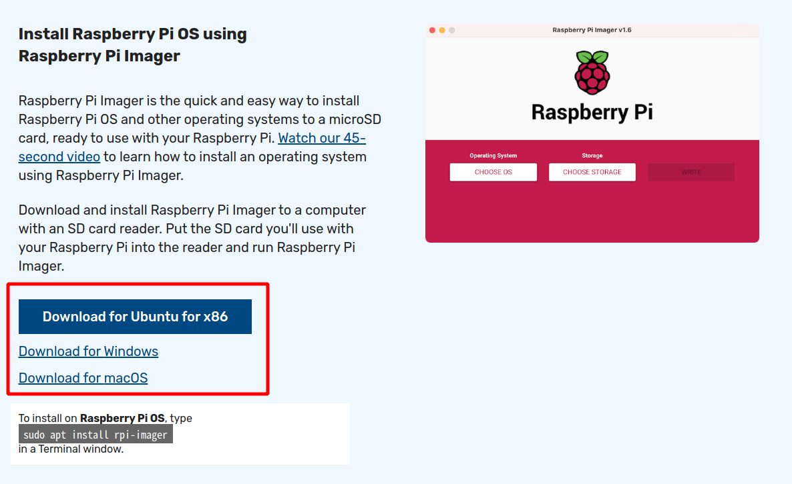
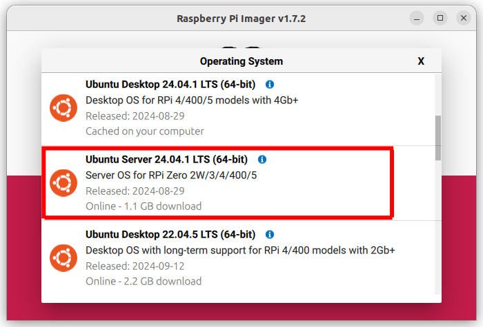
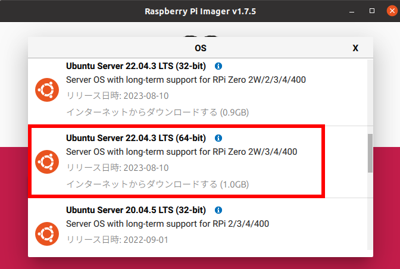
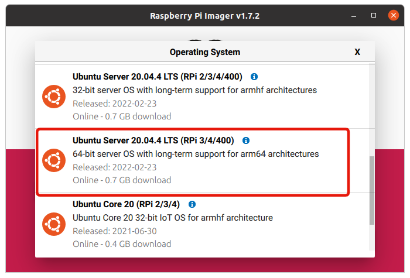
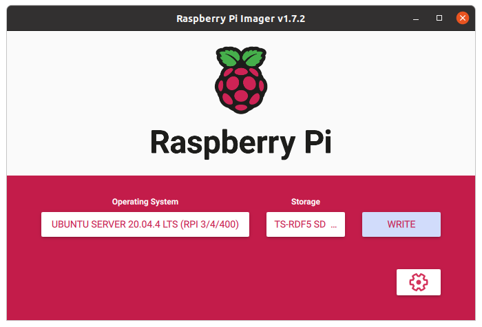
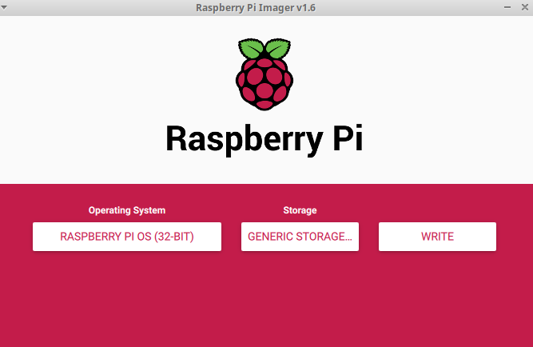
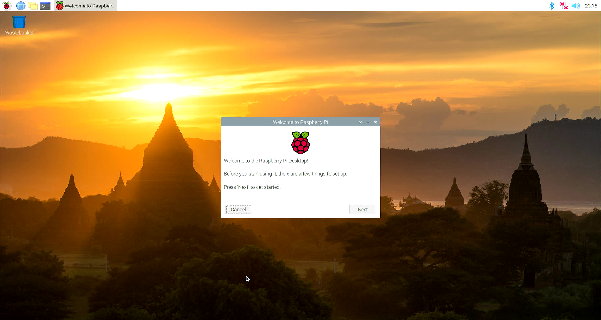
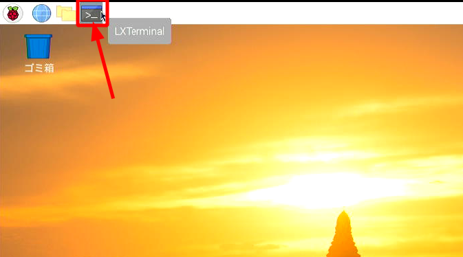

# デバイスドライバのインストール

このページでは
[Raspberry Pi Mouseのデバイスドライバ](https://github.com/rt-net/RaspberryPiMouse)
のインストール方法を説明します。

Raspberry Pi MouseのLEDやモータを駆動するためには、
デバイスドライバが必要です。

## 使用機材 {: #requirements}


* 組み立て済みRaspberry Pi Mouse本体
    * [製品マニュアル](https://rt-net.jp/products/raspberrypimousev3/#downloads)を読んで組み立て済みの状態を前提としています
    * OSの再インストールを行う場合はRaspberry Piを取り外すための工具も必要です
* Raspberry Pi Mouse用電源
    * バッテリでも電源変換ケーブルつきACアダプタでも可
* HDMIケーブルとHDMI入力付きのモニタ
* USBキーボードとマウス
* ノートパソコン等のPC


## OSのインストール {: #os-installation}

Raspberry Pi Mouseのデバイスドライバは、"Ubuntu"と"Raspberry Pi OS"（旧称"Raspbian"）に対応しています。
ここではUbuntuとRaspberry Pi OSのインストール手順を紹介します。

後ほどRaspberry Pi MouseでROSを扱う場合は、Ubuntuのインストールを推奨します。各種ROSとUbuntuのバージョン対応表は以下の通りです。

| ROS | Ubuntu |
| ---- | ---- |
| ROS Noetic | Ubuntu Server 20.04（64bit版） |
| ROS 2 Humble | Ubuntu Server 22.04（64bit版） |
| ROS 2 Jazzy |  Ubuntu Server 24.04（64bit版）|


!!! info
    出荷時に付属しているRaspberry Pi OSインストール済みのmicroSDカードを利用する場合は、OSインストール手順を飛ばしてそのまま[ソースファイルのダウンロードとインストール](#driver-installation)に進むことができます。

!!! warning
    SDカードの取り付けやRaspberry Piの電源操作時に、
    Raspberry PiやRaspberry Pi Mouse本体を**故障させないように**注意してください。
    詳細はRaspberry Pi Mouseの**[製品マニュアル](https://rt-net.jp/products/raspberrypimousev3/#downloads)を参照してください**。

=== "Ubuntu Server 24.04"
    1. [https://www.raspberrypi.org/software/](https://www.raspberrypi.org/software/){target=_blank rel=noopener} にアクセスします
    1. Raspberry Pi Imagerをダウンロードします
    
    1. SDカードをPCに接続します
    1. Raspberry Pi Imagerを起動します
    1. 書き込むOSを"Other general-purpose OS" -> "Ubuntu" -> "Ubuntu Server 24.04.* LTS"、書き込み先をSDカードに設定します __ROS 2を使う場合は64bit版__ を選択します
    
    1. "WRITE" を押して書き込みを開始します
    
    1. SDカードをRaspberry Piに取り付け、Raspberry Piの電源を入れます
    1. login:`ubuntu`、password:`ubuntu`でログインし、パスワードを変更します
    1. `$ sudo apt update && sudo apt upgrade`を実行します

=== "Ubuntu Server 22.04"
    1. [https://www.raspberrypi.org/software/](https://www.raspberrypi.org/software/){target=_blank rel=noopener} にアクセスします
    1. Raspberry Pi Imagerをダウンロードします
    
    1. SDカードをPCに接続します
    1. Raspberry Pi Imagerを起動します
    1. 書き込むOSを"Other general-purpose OS" -> "Ubuntu" -> "Ubuntu Server 22.04.* LTS"、書き込み先をSDカードに設定します __ROS 2を使う場合は64bit版__ を選択します
    
    1. "WRITE" を押して書き込みを開始します
    
    1. SDカードをRaspberry Piに取り付け、Raspberry Piの電源を入れます
    1. login:`ubuntu`、password:`ubuntu`でログインし、パスワードを変更します
    1. `$ sudo apt update && sudo apt upgrade`を実行します

=== "Ubuntu Server 20.04"
    1. [https://www.raspberrypi.org/software/](https://www.raspberrypi.org/software/){target=_blank rel=noopener} にアクセスします
    1. Raspberry Pi Imagerをダウンロードします
    
    1. SDカードをPCに接続します
    1. Raspberry Pi Imagerを起動します
    1. 書き込むOSを"Other general-purpose OS" -> "Ubuntu" -> "Ubuntu Server 20.04.* LTS"、書き込み先をSDカードに設定します __ROSを使う場合は64bit版__ を選択します
    
    1. "WRITE" を押して書き込みを開始します
    
    1. SDカードをRaspberry Piに取り付け、Raspberry Piの電源を入れます
    1. login:`ubuntu`、password:`ubuntu`でログインし、パスワードを変更します
    1. `$ sudo apt update && sudo apt upgrade`を実行します


=== "Raspberry Pi OS"
    1. [https://www.raspberrypi.org/software/](https://www.raspberrypi.org/software/){target=_blank rel=noopener} にアクセスします
    1. Raspberry Pi Imagerをダウンロードします
    
    1. SDカードをPCに接続します
    1. Raspberry Pi Imagerを起動します
    1. 書き込むOSを"Raspberry Pi OS (32-bit)"、または"Raspberry Pi OS (64-bit)"、書き込み先をSDカードに設定し、"WRITE"を押して書き込みを開始します
    
    1. SDカードをRaspberry Piに取り付け、Raspberry Piの電源を入れます
    
    1. 画面に従って初期設定します

## ネットワークへの接続 {: #network-setup}

=== "Ubuntu Server"

    HDMIケーブルとHDMI入力付きのモニタ、USBキーボードとマウスをRaspberry Piに接続して設定する方法を紹介します。

    [https://ubuntu.com/server/docs/network-configuration](https://ubuntu.com/server/docs/network-configuration)
    に詳細な説明が書かれています。
    IPアドレスの固定については[Ubuntu ServerでWi-Fiに接続し、IPアドレスを固定する](#wifi-static-ip)を参照してください。

    1. `$ sudo vim /etc/netplan/99_config.yaml`で設定ファイルを新規作成し、下記のように記述します。
    この例では、SSID：`raspimouse` パスワード：`rt-net`のネットワークに接続する場合について紹介します。
    ```yaml
    network:
        ethernets:
            eth0:
                dhcp4: true
                optional: true
        wifis:
            wlan0:
                access-points:
                    raspimouse:  #ここにSSIDを書く
                        password: rt-net #ここにパスワードを書く
                dhcp4: true
        version: 2
    ```
    1. `$ sudo netplan apply`を実行します
    1. `$ ip addr`でWi-Fiに接続し、IPアドレスを取得できているか確認します

=== "Raspberry Pi OS"
    Raspberry Pi Mouseの[製品マニュアル](https://rt-net.jp/products/raspberrypimousev3/#downloads)を参照してください。

## ソースファイルのダウンロードとインストール {: #driver-installation}

HDMIケーブルとHDMI入力付きのモニタ、USBキーボードとマウスをRaspberry Piに接続して設定する方法を紹介します。

Raspberry Pi Mouseのデバイスドライバのソースファイルは
[GitHub](https://github.com/rt-net/RaspberryPiMouse)
に公開されています。

=== "Ubuntu Server"
    1. 次のコマンドを実行し、デバイスドライバをダウンロードします
    ```sh
    $ git clone https://github.com/rt-net/RaspberryPiMouse.git
    ```
    2. 次のコマンドを実行し、Raspberry Pi Mouseを動かすための設定を行います
    ```sh
    $ cd RaspberryPiMouse/utils
    $ ./set_configs.bash
    ```
    3. 次のコマンドを実行し、Raspberry Piを再起動します
    ```sh
    $ sudo reboot
    ```
    4. 次のコマンドを実行し、デバイスドライバをインストールします
    ```sh
    $ cd RaspberryPiMouse/utils
    $ sudo apt install linux-headers-$(uname -r) build-essential
    $ ./build_install.bash
    ```
    5. コマンド実行後にブザーが鳴ればインストール完了です


=== "Raspberry Pi OS"
    1. ターミナル(`LXTerminal`)を起動します
    
    2. 次のコマンドを実行し、デバイスドライバをダウンロードします
    ```sh
    $ git clone https://github.com/rt-net/RaspberryPiMouse.git
    ```
    3. 次のコマンドを実行し、Raspberry Pi Mouseを動かすための設定を行います
    ```sh
    $ cd RaspberryPiMouse/utils
    $ ./set_configs.bash
    ```
    4. Raspberry Piを再起動します
    5. 次のコマンドを実行し、デバイスドライバをインストールします
    ```sh
    $ cd RaspberryPiMouse/utils
    $ sudo apt install raspberrypi-kernel-headers build-essential
    $ ./build_install.bash
    ```
    6. コマンド実行後にブザーが鳴ればインストール完了です

**デバイスドライバはOSを起動するたびにインストールしてください。** 上記インストール手順で設定した場合は以下のコマンドでインストールできます。

```
$ ~/RaspberryPiMouse/utils/build_install.bash
```


## その他 {: #misc}

### Ubuntu ServerでWi-Fiに接続し、IPアドレスを固定する {: #wifi-static-ip}

[https://ubuntu.com/server/docs/network-configuration](https://ubuntu.com/server/docs/network-configuration)
に詳細な説明が書かれています。

!!! info
    IPアドレスを固定するとネットワークに影響が出る場合があります。会社等で利用する場合はネットワーク管理者にお問い合わせください。

1. `$ sudo vim /etc/netplan/99_config.yaml`で設定ファイルを新規作成し、下記のように`dhcp4: false`としてIPアドレスを記述します。
この例では、IPアドレスを`192.168.11.89`に固定します。__この設定値は環境によって変わりますのでご注意ください__。
```yaml
network:
    ethernets:
        eth0:
            dhcp4: true
            optional: true
    wifis:
        wlan0:
            access-points:
                ここにSSIDを書く:
                    password: ここにパスワードを書く
            dhcp4: false
            addresses: [192.168.11.89/24]
            gateway4: 192.168.11.1
            nameservers:
                addresses: [8.8.8.8, 192.168.11.1]
    version: 2
```
1. `$ sudo netplan apply`を実行します
1. `$ ip addr`でWi-Fiに接続できているか確認します
