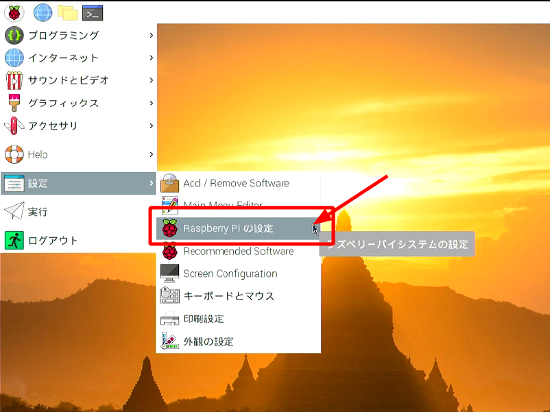

# デバイスドライバのインストール

このページでは
[Raspberry Pi Mouseのデバイスドライバ](https://github.com/rt-net/RaspberryPiMouse)
のインストール方法を説明します。

Raspberry Pi MouseのLEDやモータを駆動するためには、
デバイスドライバが必要です。

## OSのインストール

Raspberry Pi Mouseのデバイスドライバは`Ubuntu`と`Raspberry Pi OS (旧称Raspbian)`に対応しています。

ここではUbuntu（`Ubuntu Server 20.04`）と、Raspberry Pi OSのインストール手順を紹介します。

後ほどRaspberry Pi Mouseで**ROSを扱う場合はUbuntu Serverのインストールを推奨します**。

!!! warning
    SDカードの取り付けやRaspberry Piの電源操作時に、
    Raspberry PiやRaspberry Pi Mouse本体を**故障させないように**注意してください。
    詳細はRaspberry Pi Mouseの**製品マニュアルを参照してください**。

=== "Ubuntu Server 20.04"
    1. [https://www.raspberrypi.org/software/](https://www.raspberrypi.org/software/){target=_blank rel=noopener} にアクセスします
    1. Raspberry Pi Imagerをダウンロードします
    
    1. SDカードをPCに接続します
    1. Raspberry Pi Imagerを起動します
    1. 書き込むOSを`Other general purpose OS -> Ubuntu -> Ubuntu Server 20.04.2 LTS`、書き込み先をSDカードに設定し、`WRITE`を押して書き込みを開始します
    
    1. SDカードをRaspberry Piに取り付け、Raspberry Piの電源を入れます
    1. `login:ubuntu`、`password:ubuntu`でログインし、パスワードを変更します
    1. `$sudo apt update && sudo apt upgrade`を実行します

=== "Raspberry Pi OS"
    1. [https://www.raspberrypi.org/software/](https://www.raspberrypi.org/software/){target=_blank rel=noopener} にアクセスします
    1. Raspberry Pi Imagerをダウンロードします
    
    1. SDカードをPCに接続します
    1. Raspberry Pi Imagerを起動します
    1. 書き込むOSを`Raspberry Pi OS (32-bit)`、書き込み先をSDカードに設定し、`WRITE`を押して書き込みを開始します
    
    1. SDカードをRaspberry Piに取り付け、Raspberry Piの電源を入れます
    
    1. 画面に従って初期設定します


## ソースファイルのダウンロードとインストール

Raspberry Pi Mouseのデバイスドライバのソースファイルは
[GitHub](https://github.com/rt-net/RaspberryPiMouse)
に公開されています。

=== "Ubuntu Server"
    1. 次のコマンドを実行し、デバイスドライバをインストールします
    ```sh
    $ git clone https://github.com/rt-net/RaspberryPiMouse.git
    $ cd RaspberryPiMouse/utils
    $ sudo apt install linux-headers-$(uname -r) build-essential
    $ ./build_install.bash
    ```
    1. コマンド実行後にブザーが鳴ればインストール完了です。
    1. パルスカウンタの動作を安定させるためI2Cのボーレートを変更します
        1. `/boot/firmware/config.txt`を編集し、`dtparam=i2c_baudrate=62500`を追記します
        1. Raspberry Pi を再起動します
        1. `$ printf "%d\n" 0x$(xxd -ps /sys/class/i2c-adapter/i2c-1/of_node/clock-frequency)`を実行し、`62500`と表示されたら設定完了です。


=== "Raspberry Pi OS"
    1. `Raspberry Piの設定`を開きます
    
    1. `インターフェイス`に進み、`SPI`と`I2C`の機能を有効にします
    
    1. ターミナル(`LXTerminal`)を起動します
    
    1. 次のコマンドを実行し、デバイスドライバをインストールします
    ```sh
    $ git clone https://github.com/rt-net/RaspberryPiMouse.git
    $ cd RaspberryPiMouse/utils
    $ sudo apt install raspberrypi-kernel-headers build-essential
    $ ./build_install.bash
    ```
    1. コマンド実行後にブザーが鳴ればインストール完了です。
    1. パルスカウンタの動作を安定させるためI2Cのボーレートを変更します
        1. `/boot/config.txt`を編集し、`dtparam=i2c_baudrate=62500`を追記します
        1. Raspberry Pi を再起動します
        1. `$ printf "%d\n" 0x$(xxd -ps /sys/class/i2c-adapter/i2c-1/of_node/clock-frequency)`を実行し、`62500`と表示されたら設定完了です。

**デバイスドライバはOSを起動するたびにインストールしてください。**

## その他

### Ubuntu ServerでWi-Fiに接続し、IPアドレスを固定する

[https://ubuntu.com/server/docs/network-configuration](https://ubuntu.com/server/docs/network-configuration)
に詳細な説明が書かれています。

1. `$ sudo vim /etc/netplan/99_config.yaml`で設定ファイルを新規作成し、下記のように記述します。
この例では、IPアドレスを`192.168.11.89`に固定します。
```txt
network:
    ethernets:
        eth0:
            dhcp4: true
            optional: true
    wifis:
        wlan0:
            access-points:
                ここにSSIDを書く:
                    password: ここにパスワードを書く
            dhcp4: false
            addresses: [192.168.11.89/24]
            gateway4: 192.168.11.1
            nameservers:
                addresses: [8.8.8.8, 192.168.11.1]
    version: 2
```
1. `$ sudo netplan apply`を実行します
1. `$ ip addr`でWi-Fiに接続できているか確認します
